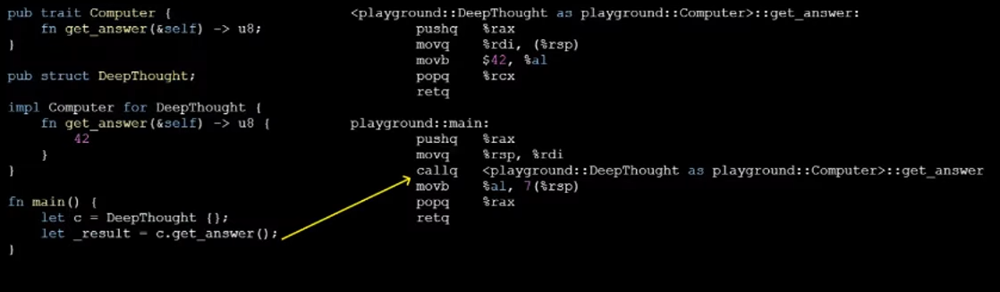

# Traits | Tutorial | Rust | Quickstarts
- 
- You can define traits on `enum`
- They are system `Traits`
    - `Default` -> 

Basic example: 
```rust
pub trait Computer {
    fn get_answer(&self) -> u8;
}

// Unit `struct`
pub struct DeepThought;

// A `Trait` for `struct`
impl Computer for DeepThought {
    fn get_answer(&self) -> u8 {
        42
    }
}

fn main() {
    let c = DeepThought {};
    let _result = c.get_answer();
}
```
What the looks likes once translated to Assembly code: 

(You can use Rust playground to get the Assembly code)

Things that you notice: 
- The *interface* was gone
- The only trace remaning is the name `<playground::DeepThought [...]`
- So what this means is that it is *zero cost* because it doesn't really exist at runtime

## Traits on `enum`
```rust
// Everything in the () are `Traits`
// This attribute does a auto implementation
#[derive(Debug, Copy, Clone, PartialEq, Eq)]
pub enum SquareContent {
    Empty,
    X,
    O,
}

// `Default` is a trait from the standard lib
impl Default for SquareContent { [...]
```

Typecasting: 
```rust
// `From<u8>` is for typecasting
// It means I want to generate a SquareContent from a unsigned byte from a eight bits
impl From<u8> for SquareContent { [...]
```

```rust
// Rust is smart enough that it knows that it needs the default of `SquareContent` default value based on what is on the right.
assert_eq!(SquareContent::Empty, Default::default());
```

```rust
// Rust knows that from needs a `u8` value because of the trait
assert_eq!(SquareContent::X, SquareContent::from(1));
```

## Example: *Tic Toc Toe* 


## Resources
- [Rust Linz, July 2021 - Rainer Stropek - Traits, not your grandparents' interfaces | YouTube](https://www.youtube.com/watch?v=B0fL3WmJZsc)
    - [Traits - Not Your Grandparents' Interfaces | Slides.com](http://slides.com/rainerstropek/rust-traits/fullscreen)
    - [Tic Tac Toe (example) | rust-samples | GitHub](https://github.com/rstropek/rust-samples/tree/master/tictactoe)
